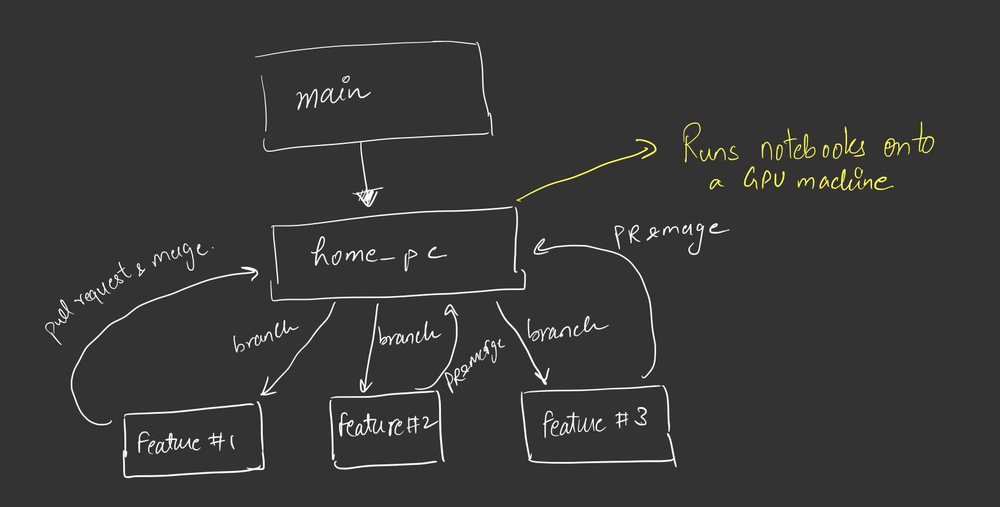
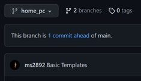
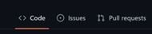

# MLMI 4 Replication Project
Implementation of Paper for MLMI4 Coursework. This GitHub repository implements the paper [Weight Uncertainty in Neural Networks](https://arxiv.org/pdf/1505.05424.pdf) written by [Charles Blundell](https://www.gatsby.ucl.ac.uk/~ucgtcbl/), [Julien Cornebise](https://cornebise.com/julien/), [Koray Kavukcuoglu](https://koray.kavukcuoglu.org/) and [Daan Wierstra](https://scholar.google.com/citations?user=aDbsf28AAAAJ&hl=en)


## Basic Structure (for collaborators)
---
data (Not Present in the Repo): This folder would contain the data that will be used for this project. Please note that this will be dummy folder, the dataset won't actually be on the github repository but only used as a reference for local replication of the project.

__NOTE__: You will have to create a data folder in the local repository. To prevent uploading heavy datasets onto the github repo, the folder named data won't be pushed.

Features: This folder would contain any kind of features extracted from the dataset

Models: This folder will contain the different model implementations that will be replicated throughout this project. The training script / class can be kept here. A basic empty file for classficiation, regression and reinforcement learning models are present. Feel free to change accordingly.

Notebooks: Keep the notebooks created (Finished) in this folder. Also for initial development, have the notebooks in the current directory. This way you can import modules like models.file_name.class_name or models.file_name.function_name

Report: The pdf files that can be created for this project can be created here

Utils: This folder keeps all the auxillary functions needed to implement the paper. Things like Augmentation, Resizing etc etc.

Visualization: The script / class for visualizing the models can be kept here. Also the images can be kept here as well 

## Github Basics (for collaborators)
---
Having some basic commands here for reference.

### Methodology of using this Repository

You may notice an unusal structure that is present in this repository. There is a branch called home_pc who's sole purpose is to take whatever notebooks that are present in that repository and run it and push the code back. 

These runs will be performed on a GPU that's back at my home hence the name home_pc. There are chances that CPU might be enough for running and training the models but there is a high chance that performance metrics achieved on GPU might be slightly different than that achieved on a CPU (usually is around 1-2%). 

Nevertheless, the structure of the workflow is given below. 



Since the tasks in this paper are divided up into Classification, Regression and Reinforcement Learning, the feature boxes can be assumed to be these tasks.

To perform these tasks please create a branch from the home_pc branch. Once you are done with the coding and wish to run it on the GPU, create a pull request and merge it to the home_pc branch.

__Note__: The PR must be reviewed by someone to prevent any clashes or errors or inconsistencies.

To enable this workflow, a couple of basic github commands and functionailities are given below for everyone's reference. 

### Creating a branch
---
1) Upon opening the github repository you will most likely see a drop down on the top left of the file list as shown here:



2) Click on the home_pc drop down and select _View all branches_.

3) Click on the _New Branch_ button and give an appropriate branch name to the branch. Also make sure to choose the branch source as __home_pc__.

### Cloning a Repository (from a branch)
---
1) Initially clone the repository from the main branch (Once)

```
git clone https://github.com/ms2892/advanced-ml
```

2) Pull the updates on this repository (everytime there is an update on the repository).

```
git pull
```

3) Use the git checkout command to access a particular branch

```
git checkout branch_name
```

### Pushing to a branch
---
1) First of all make sure you are making your edits in the correct branch. Please follow steps 2 and 3 from Cloning a repository section

2) Git pushes code in 3 steps: Add, Commit, Push. Follow the three command lines for a simple bare bone push

```
git add .                      # Adds your changes to the working tree
git commit -m "Message"        # Commits the changes with a message.
git push origin branch_name    # Pushes your changes onto the branch.
```

__Note__: There may be cases where there are merge conflicts. This usually happens when multiple people make changes to the same file and try to merge two branches. Read through [Github Repo on Merge Conflicts](https://docs.github.com/en/pull-requests/collaborating-with-pull-requests/addressing-merge-conflicts/resolving-a-merge-conflict-on-github) to help yourself. 


### Creating a Pull Request
---
1) Click on the Pull Request tab present amongst the other tabs.



2) Click on New Pull Request

3) In the compare changes section, keep the base branch as _home_pc_ and the compare branch as your own branch.

4) Click on the Create New Pull Request button

5) Write the description and title of the pull request

6) On the right pane, on Reviewers choose one of the other two collaborators for Reviewing your Pull Request. 

6) Click on Create Pull Request 

7) Someone will review your code and merge it onto the _home_pc_ branch.

Reference: [Github Repo on Pull Request](https://docs.github.com/en/desktop/contributing-and-collaborating-using-github-desktop/working-with-your-remote-repository-on-github-or-github-enterprise/creating-an-issue-or-pull-request)